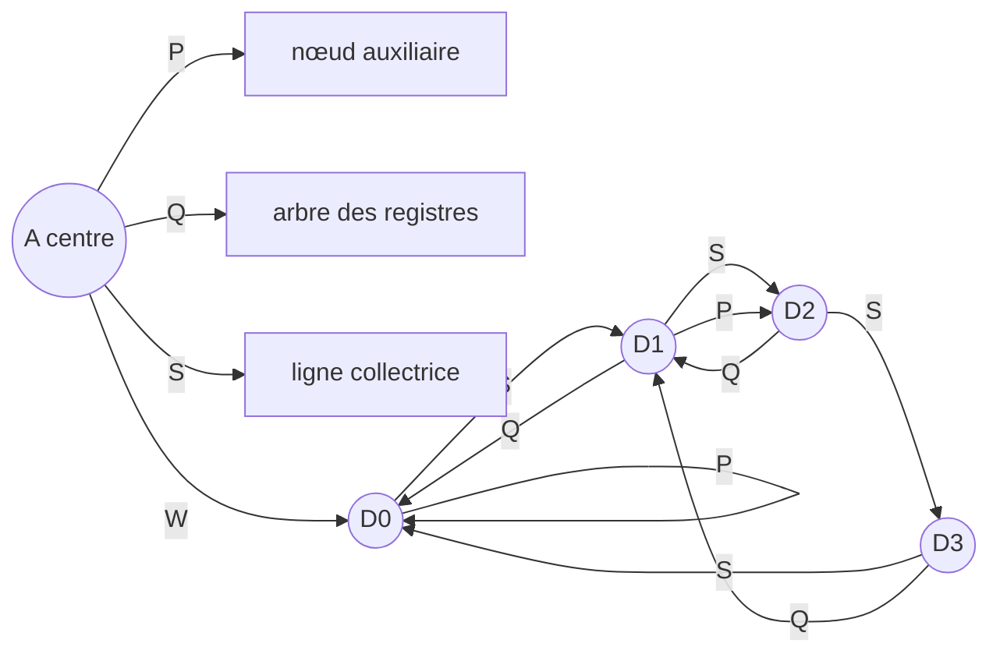
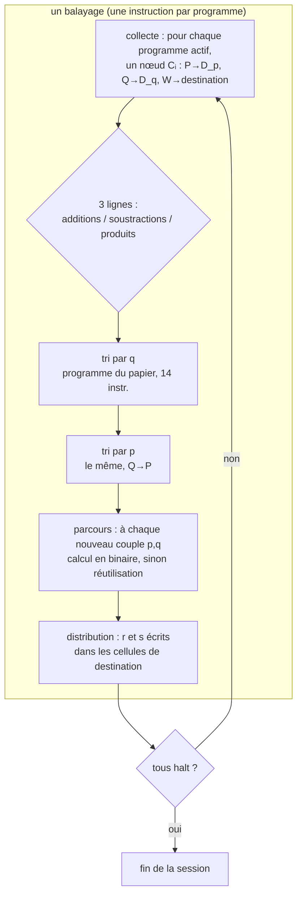
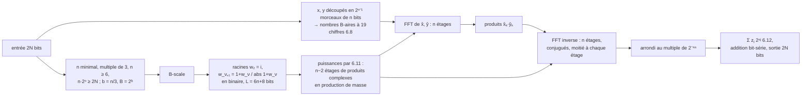
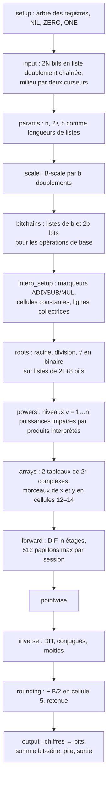

# Multiplication en temps linéaire sur une Storage Modification Machine

Implémentation exécutable du théorème 6.1 de **A. Schönhage, « Storage Modification Machines »,
SIAM J. Comput. 9(3), 1980, pp. 490–508** : *il existe une SMM qui multiplie deux entiers de N bits
en O(N) pas.*

Deux fichiers Python (bibliothèque standard seulement, typés, `ruff` propre) :

| fichier | ce que c'est | statut |
|---|---|---|
| `smm_schoenhage.py` | **la version fidèle au §6 du papier** : alphabet {P, Q, S, W}, langage du §2, B-scale, production en masse avec le programme de tri du papier recopié mot pour mot, FFT complexe en virgule fixe | ce qu'il faut lire |
| `smm_multiply.py` | la première version, écrite avant d'avoir le papier : SMM sur {0, 1}, transformée modulaire exacte (NTT) et table de chiffres précalculée | gardée pour l'histoire et la comparaison |

Tout ce qui est calculé est calculé par la machine, par manipulation de pointeurs. L'hôte Python
encode la bande d'entrée, décode la bande de sortie, et (dans les tests) recalcule les valeurs
attendues.

```
$ python3 smm_schoenhage.py --multiply 123456789 987654321
123456789 × 987654321 = 121932631112635269  (correct; 247,080,724 steps, 16,347,363 nodes)
```

---

## 1. Ce qu'est une SMM (le §2 du papier)

Une *Storage Modification Machine* n'a **ni registres numériques, ni adresses, ni arithmétique**.
Sa mémoire est un graphe orienté : des nœuds, chacun portant un pointeur par lettre d'un alphabet
fini Δ, et un nœud distingué, le **centre** A. Un mot W ∈ Δ* désigne le nœud p\*(W) qu'on atteint
en suivant les lettres depuis le centre.



*Une Δ-structure pour Δ = {P, Q, S, W} et B = 4 : le centre, et la B-scale D₀…D₃ accrochée à A W.*

Le programme est une liste d'instructions étiquetées, coût **1 pas par instruction exécutée**
(une conditionnelle compte 1 quel que soit son résultat) :

| instruction | effet |
|---|---|
| `new W;` | crée un nœud y, le fixe au bout du chemin W (le dernier pointeur du chemin pointe vers y) ; **tous les pointeurs de y pointent vers l'ancien p\*(W)** |
| `set W to V;` | le dernier pointeur du chemin W est redirigé vers p\*(V) |
| `if U = V then σ;` / `if U ≠ V then σ;` | σ (une des autres instructions) n'est exécutée que si p\*(U) = p\*(V) (resp. ≠) |
| `input λ0, λ1;` | lit un bit, saute à λ0 ou λ1 ; si l'entrée est épuisée, passe à l'instruction suivante |
| `output β;` `goto λ;` `halt;` | évidents |

Le seul **test** disponible est l'égalité de deux nœuds. Un « chiffre » n'est donc pas un nombre :
c'est **un pointeur vers un nœud particulier**, et calculer, c'est refaire des pointeurs.

`smm_schoenhage.py` contient un analyseur et un imprimeur de ce langage (`parse`, `Program.listing`) ;
le programme complet est dans [`results/schoenhage_program.smm`](results/schoenhage_program.smm)
(21 610 instructions, 16 k `set`, 3,3 k `new`, 1,6 k `if`, 655 `goto`, 1 `input`, 1 `halt`).

Le contre-exemple du §2 est dans les tests : `start: new PP; set QQ to P; halt;` donne
p\*(PP) = p\*(QQ) = A ≠ p\*(P), parce que `new` recopie les anciens pointeurs.

---

## 2. Pourquoi ce n'est pas trivial

La multiplication d'école par blocs de k = O(log n) bits, avec une table des produits de blocs,
semble donner O(n²/log² n) recherches à O(1) chacune. Sur une machine à pointeurs de degré borné,
**aucune** recherche en table ne coûte O(1) dans le pire cas : en t pas on n'atteint que O(deg^t)
nœuds, alors qu'il y a 2^k entrées, donc une recherche coûte Θ(k) = Θ(log n) et le total reste
quadratique à un facteur log près. Le O(N) de Schönhage vient de deux idées :

1. **Une transformée de Fourier rapide** sur des mots de Θ(log N) bits : le nombre d'opérations sur
   chiffres tombe à O(N).
2. **La production en masse** (§6.2, lemme 6.2) : les opérations sur chiffres de toutes les
   « lignes de calcul » en cours sont **collectées**, **triées** par opérandes en temps linéaire
   (un tri radix écrit en 14 instructions SMM), chaque opération **distincte** est calculée une seule
   fois, puis **distribuée**. Un balayage de m programmes coûte O(m + b²B²), où B = 2^b est la base
   des chiffres.

---

## 3. Le §6 en quatre schémas

### 3.1 La B-scale (§6.1)

B = 2^b nœuds D₀…D_{B−1} liés en cycle par S (successeur), avec P (doublement) et Q (moitié) :
D_i P = D_{2i} pour i < B/2, D_{2i} Q = D_{2i+1} Q = D_i. Un chiffre p **est** un pointeur vers D_p.
La parité se lit en O(1) : p est pair si et seulement si D_p Q P = D_p. Un chiffre se traduit en
b bits (et retour) en O(b) pas.

Les trois opérations de base, calculées **via le binaire** :

| formule | coût | rôle chez moi |
|---|---|---|
| (6.3) p + q = r + sB | O(b) | additions, retenues, extraction du signe (s de p + p) |
| (6.4) p − q = r·(−1)^s | O(b) | complément d'un chiffre : (B−1) − q, toujours s = 0 |
| (6.5) p·q = r + sB | O(b²) | produits partiels, moitié d'un chiffre (p·B/2) |

### 3.2 Le mode interprétatif et la production en masse (§6.2)



Le programme de tri du papier est transcrit tel quel dans `Builder.sort_line` (la ligne à trier
pend au pointeur S du centre, A W = D₀, le nœud auxiliaire est A P) :

```
set P to [];                       # (ajout, voir §5)
new P; set PS to []; set WW to W;
empty:  set WW to WWS; set WWW to P; if WW ≠ P then goto empty;
        goto test;
insert: set PW to S; set S to SS;
        set PWS to PWQWS; set PWQWS to PW; set PWQW to PW;
test:   if S ≠ [] then goto insert;
        set S to PS;
```

Pendant l'insertion, le pointeur W de D_j pointe toujours vers le dernier nœud inséré dont la clé
est j (ou vers l'auxiliaire) : chaque nœud est inséré juste derrière son prédécesseur de même clé.
Deux passes (q puis p) et les couples égaux sont adjacents : c'est un tri radix stable.

### 3.3 La multiplication (§6.3)



Les nombres sont des **complexes en virgule fixe à 19 chiffres B-aires** (18 fractionnaires + 1 de
tête), de module ≤ 1. Le papier justifie « 6n bits suffisent, pourvu que n ≥ 6 » par l'analyse
d'arrondi de Schönhage–Strassen ; le modèle hôte le confirme largement (§6 ci-dessous).

### 3.4 Les tailles

| N (bits) | n | B | points de FFT | chiffres | précision |
|---|---|---|---|---|---|
| ≤ 192 | 6 | 4 | 64 | 2 bits | 36 bits fractionnaires |
| ≤ 2 304 | 9 | 8 | 512 | 3 bits | 54 bits |
| ≤ 24 576 | 12 | 16 | 4 096 | 4 bits | 72 bits |

B = O(N^{1/3}) : le terme b²B² du lemme 6.2 est o(N/log N), c'est ce qui rend le tout linéaire.

---

## 4. Ce que fait `smm_schoenhage.py`, phase par phase



Chaque bloc est une méthode `ph_*` de `Builder` ; le compteur de pas par phase est dans
`RunResult.phase_steps`.

### 4.1 Les structures dans la Δ-structure

```
centre A :  Q → arbre des registres (profondeur 4 : 256 registres, chemins « Qxyzw »)
            W → D₀ (la B-scale)          S, P → brouillon du programme de tri

liste :     [tête factice] -S-> n₁ -S-> n₂ -S-> … -S-> NIL       (P = précédent, W = charge)

cellule de chiffre :   W → D_p     S → cellule suivante (poids supérieur)     P → précédente
nombre (19 cellules) : tête -S-> c₀ (B⁻¹⁸) … c₁₇ (B⁻¹) c₁₈ (unités) ; tête P → c₁₈
                       complément à B : valeur = Σ c_k B^(k−18), c₁₈ ≥ B/2 ⇔ négatif
complexe Z :           P → partie réelle   Q → partie imaginaire   S → suivant
                       W → (racines seulement) nœud des sommes : P → re+im, Q → im−re

programme interprété : H (W → instruction courante, S → instance suivante)
    instruction I :    P → cellule opérande p   Q → cellule opérande q   S → I suivante
                       W → descripteur K :  P → cellule pour r   Q → cellule pour s   W → ADD | SUB | MUL
    collecteur Cᵢ :    P → D_p   Q → D_q   W → K   S → Cᵢ₊₁            (formule 6.7 du papier)
```

Une instruction interprétée coûte 2 nœuds + ses cellules de résultat. Les programmes d'un étage
sont **construits** par des boucles SMM qui parcourent les chaînes de cellules (pas déroulées), puis
**exécutés** par balayages ; leurs nœuds deviennent inaccessibles et sont récupérés.

### 4.2 Les programmes numériques (ce qu'un « papillon » contient)

| programme | opérations de base | remarque |
|---|---|---|
| addition à 19 chiffres | 3 par chiffre : p+q → (r₁, s₁) ; r₁+retenue → (r₂, s₂) ; s₁+s₂ → retenue | complément à B, retenue ≤ 1 |
| soustraction | 19 compléments (6.4 avec p = B−1) + une addition avec retenue entrante 1 | |
| produit réel tronqué | 208 produits partiels (colonnes ≥ 17 sur 37) + accumulation ligne par ligne, 5 additions par colonne + corrections de signe | ≈ 1 600 opérations |
| moitié | u_k·(B/2) donne à la fois ⌊u_k/2⌋ et (u_k mod 2)·B/2 | 19 produits + 19 additions |
| produit complexe | 3 produits réels (k₁ = t_re·(z_re+z_im), k₂ = z_re·(t_im−t_re), k₃ = z_im·(t_re+t_im)) | sommes des racines précalculées |
| papillon direct (DIF) | (F, G) ← (F+G, (F−G)·w) | ≈ 5 300 opérations |
| papillon inverse (DIT) | (F, G) ← ((F+G·w̄)/2, (F−G·w̄)/2) | mêmes trois produits, signes permutés |

Pourquoi ligne par ligne et pas colonne par colonne : avec B = 4, une colonne de 38 termes ne tient
pas dans deux chiffres. L'accumulation par lignes garde une retenue ≤ 3 < B.

### 4.3 Correspondance papier ↔ code

| papier | code |
|---|---|
| §2, instructions et coût | `Instr`, `run_reference`, `FastSMM` (un bloc de base = une fonction Python compilée) |
| (6.1)–(6.2) B-scale | `Builder.ph_scale` |
| (6.3)–(6.5) opérations de base | `emit_op_add`, `emit_op_sub`, `emit_op_mul` |
| (6.7) lignes collectrices, balayage | `emit_run_programs` |
| programme de tri du §6.2 | `sort_line` (verbatim) |
| lemme 6.2, une opération distincte calculée une fois | `emit_execute_sorted` |
| §6.3 choix de n, b | `ph_params` (n·2ⁿ ≥ 2N vérifié en parcourant des listes) |
| (6.8) découpage | `ph_arrays` |
| racines « in any crude manner » | `ph_roots` (racine carrée et division restaurantes sur listes de bits) |
| (6.11) puissances | `ph_powers` |
| FFT, n étages de h = f ± g·w | `ph_forward`, `ph_inverse`, `emit_pairs` |
| (6.12) somme finale | `ph_output` |

---

## 5. Les choix que le papier laisse ouverts (et ce que j'ai décidé)

- **Ordre des transformées** : DIF à l'aller (ordre naturel → ordre bit-inversé), DIT au retour :
  aucune permutation à faire, et les listes de puissances w_ν^κ servent directement de facteurs à
  l'étage ν−1.
- **Signe** : complément à B. Le signe d'un nombre est la retenue de c₁₈ + c₁₈ (une opération de
  base), les corrections de signe d'un produit sont −neg_x·Y·B¹⁹ − neg_y·X·B¹⁹ modulo B³⁸.
- **Troncature du produit** : seules les colonnes ≥ 17 des 37 sont calculées (une colonne de garde).
  Le modèle hôte donne une erreur maximale de 0,02·2⁻⁴ⁿ pour 0,5·2⁻⁴ⁿ toléré, y compris en n = 6.
- **Produit complexe à 3 multiplications**, avec w_re ± w_im précalculées une fois par racine.
- **Au plus 512 programmes par session** d'interprétation : les papillons d'un étage sont
  indépendants, cela ne change que la mémoire vive.
- **Une instruction ajoutée au programme de tri** : `set P to []` avant `new P`. Le papier ne dit
  pas ce que contient A P avant le tri ; comme `new` recopie ces pointeurs dans le nœud auxiliaire,
  sans cet ajout chaque ligne triée de chaque balayage restait accessible pour toujours (80 % des
  nœuds vivants, mesuré).
- **Ramasse-miettes** : la sémantique du §2 réduit la structure à la partie accessible depuis le
  centre ; le runtime le fait par marquage-compactage quand les tableaux dépassent un seuil.
  `RunResult.nodes` compte chaque `new` exécuté, `peak_nodes` la taille maximale des tableaux.

---

## 6. Vérification (`--test`, 31 contrôles, tous verts)

| ce qui est vérifié | comment |
|---|---|
| sémantique du §2 | le contre-exemple du papier ; un programme de copie inversée ; interpréteur de référence = machine compilée (sortie, pas, nœuds) |
| syntaxe | `parse(prog.listing())` redonne le même listing (21 610 instructions) |
| n, 2ⁿ, b, B-scale | pour N = 1, 192, 193, 2304, 2305 ; tous les pointeurs P et Q de la scale |
| opérations de base | les 3·B² couples pour B = 4, 8, 16 |
| programmes numériques | +, −, ·, /2, deux produits complexes, comparés chiffre par chiffre au modèle hôte |
| racines et puissances | w₂…w_n et tous les w_ν^κ, égalité exacte au modèle, n = 6, 9, 12 |
| modèle hôte seul | 23 produits exacts par n, pire erreur 0,0044·2⁻⁴ⁿ (n = 6) et 0,0001 (n = 9) |
| la machine | 10 produits à n = 6 (dont (2¹⁹²−1)²), 2 à n = 9 (N = 300, 2304), contre les entiers Python |
| référence = compilé | sur une multiplication complète : 230 950 872 pas, 16 347 247 nœuds, identiques (`results/refcheck_faithful.txt`) |

`FixedModel` (partie 5 du module) émule sur des entiers Python exactement l'arithmétique que la
machine exécute : c'est ce qui permet de comparer des valeurs intermédiaires, pas seulement le
produit final.

---

## 7. Mesures (`--bench`, poito, 23/09/2026)

Le travail d'une exécution est fixé par n, pas par N : l'abscisse honnête est le plus grand N de
chaque classe, N = n·2ⁿ⁻¹.

| n | B | N | pas | pas / N | pas / (n·2ⁿ) | nœuds vivants (pic) | durée |
|---|---|---|---|---|---|---|---|
| 6 | 4 | 192 | 251 790 964 | 1 311 411 | 655 706 | 8,0 M | 29 s |
| 9 | 8 | 2 304 | 2 787 786 704 | 1 209 977 | 604 988 | 13,2 M | 320 s |
| 12 | 16 | 24 576 | 31 953 715 917 | 1 300 200 | 650 100 | 40,7 M | 3 127 s |

Lecture :

- **pas / N est plat** sur un facteur 128 de N (1,21 à 1,31 M) : c'est la linéarité.
- Le creux à n = 9 et la remontée à n = 12 viennent du terme b²B² de O(m + b²B²) : B² opérations
  distinctes sont calculées à chaque balayage quel que soit m, et le plafond de 512 programmes par
  session ramène m/B² à 2 pour n = 12 (8 pour n = 9, 4 pour n = 6). Lever le plafond ferait
  baisser la constante à n = 12 au prix de la mémoire vive.
- La constante est grande (≈ 1,2 M de pas par bit d'entrée) : ≈ 5 300 opérations de base par
  papillon, ≈ 60 pas SMM par opération (construction ≈ 12, collecte ≈ 10, deux tris ≈ 16, calcul
  amorti, distribution ≈ 5), 2n + 1 étages. C'est le théorème tel quel : linéaire, pas rapide.
- Répartition : ≈ 59 % dans les deux FFT directes, 31 % dans l'inverse, 7 % dans les produits
  point à point, 4 % dans les puissances des racines ; le reste (entrée, paramètres, B-scale,
  racines en binaire, arrondi, sortie) est sous 0,5 %.

La machine compilée tourne à ≈ 10 M de pas par seconde (CPython 3.14).

---

## 8. Utilisation

```
python3 smm_schoenhage.py --test            # les 31 contrôles (~25 min ; --quick : ~3 min)
python3 smm_schoenhage.py --multiply 6 7    # un produit, avec les compteurs
python3 smm_schoenhage.py --bench 8 192 2304 --out results/bench.jsonl
python3 smm_schoenhage.py --listing         # le programme dans la syntaxe du §2
```

En Python :

```python
import smm_schoenhage as m
prod, res = m.smm_multiply(2**100 + 3, 2**90 - 1)
res.steps, res.nodes, res.phase_steps["forward"]
```

`smm_multiply.py` (la version NTT) a la même interface : `--test`, `--bench`, `smm_multiply(x, y)`.

---

## 9. La première version, et pourquoi elle reste

`smm_multiply.py` a été écrite avant d'avoir le papier, à partir de sa description de seconde main
(Fürer 2014 : « sorting and table look-up for the mass production of short products »). Elle
partage l'architecture (mots de Θ(log n) bits, transformée, recherches groupées après un tri en
temps linéaire) mais diffère en quatre points :

| | `smm_multiply.py` | `smm_schoenhage.py` (papier) |
|---|---|---|
| anneau | NTT exacte modulo q = h·β² + 1, module certifié par a^((q−1)/2) ≡ −1 | FFT complexe en virgule fixe, 19 chiffres |
| chiffres | table complète des β² couples, précalculée, lignes diffusées à chaque tour | chaque opération distincte recalculée en binaire à la demande |
| alphabet | {0, 1}, enregistrements = arbres binaires de profondeur fixe | {P, Q, S, W} |
| exécution | tours compilés à la construction | programmes interprétés, un pointeur d'instruction par programme |

Elle est correcte et linéaire elle aussi (≈ 8–10 k pas par bit, sa constante est plus petite parce
que sa table remplace le calcul des opérations distinctes), mais ce n'est **pas** la construction du
papier. Ses mesures sont dans `results/bench.jsonl` et `results/bench_summary.txt`.

---

## 10. Fichiers

```
smm_schoenhage.py                  la version fidèle (≈ 2 300 lignes) : runtime §2, assembleur,
                                   Builder (phases), Inspector, FixedModel, tests, banc, CLI
smm_multiply.py                    la version NTT
results/schoenhage_program.smm     le programme complet dans la syntaxe du papier
results/bench_faithful.jsonl       une ligne JSON par exécution du banc (pas par phase compris)
results/test_full_faithful.log     la suite complète (31 contrôles) sur poito
results/refcheck_faithful.txt      interpréteur de référence = machine compilée, sur un produit complet
results/bench.jsonl, bench_summary.txt, test_full.log      la version NTT
```

---

## 11. Ce qui a été fait, dans l'ordre (23/09/2026)

1. Première version (NTT, recherches groupées après tri) écrite avant d'avoir le papier, à partir de
   sa description de seconde main ; tests, banc.
2. Recherche du papier de 1980 (accès fermé ; l'abstract LNCS 67 de 1979 fait deux pages) ; le PDF
   fourni, lecture du §6.
3. Modèle hôte exact de l'arithmétique du §6.3 pour vérifier la précision annoncée avant d'écrire
   une ligne de SMM : erreur maximale 0,018·2⁻⁴ⁿ même sans aucune colonne basse ; choix G = 17 et du
   produit complexe à 3 multiplications.
4. Runtime du §2 (référence + compilé), assembleur avec boucles structurées, arbre de registres.
5. Phases une par une, chacune testée en lisant la Δ-structure finale : paramètres et B-scale ;
   opérations de base sur toutes les paires ; mode interprétatif et programmes numériques (justes
   du premier coup contre le modèle) ; racines en binaire (égalité exacte) ; transformées et sortie
   (produit juste du premier coup).
6. Mémoire : stockage en `array` essayé (2,4× plus lent) et abandonné ; ramasse-miettes ; puis la
   fuite du nœud auxiliaire du tri (§5), trouvée en mesurant les nœuds vivants après chaque
   collecte : 9,7 M → 1 M.
7. Bancs sur poito (n = 6, 9, 12 ; le run n = 12 : 32 G de pas, 52 min, 62 collectes, 1,9 G de `new`),
   suite complète, référence = compilé.
